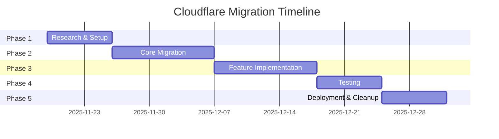

# Cloudflare Workers Migration - Complete Implementation Plan

> **Project**: SY Developers CMS
> **Migration**: Railway/MongoDB → Cloudflare Workers/D1
> **Timeline**: 6 weeks
> **Status**: Planning
> **Issue**: [#69](https://github.com/sydevs/sydevs-cms/issues/69)

---

## Table of Contents

1. [Overview](#overview)
2. [Architecture Changes](#architecture-changes)
3. [Prerequisites](#prerequisites)
4. [Phase 1: Research & Setup](#phase-1-research--setup)
5. [Phase 2: Core Migration](#phase-2-core-migration)
6. [Phase 3: Feature Implementation](#phase-3-feature-implementation)
7. [Phase 4: Testing](#phase-4-testing)
8. [Phase 5: Deployment](#phase-5-deployment)
9. [Rollback Procedures](#rollback-procedures)
10. [Troubleshooting](#troubleshooting)

---

## Overview

This document provides a complete, step-by-step implementation plan for migrating the SY Developers CMS from Railway deployment with MongoDB to Cloudflare Workers with D1 database.

### Key Decisions

- ✅ **GraphQL Support**: Confirmed working (wrangler 4.42.2+)
- ✅ **Video Processing**: Cloudflare Stream (not FFmpeg + queue)
- ✅ **Email**: Resend HTTP API (not SMTP)
- ✅ **Database**: Fresh start (no data migration)
- ✅ **Testing**: In-memory SQLite (not MongoDB Memory Server)

### Benefits

- **Cost**: $16-20/month (vs $21-40/month current)
- **Performance**: Global edge deployment
- **Scalability**: Automatic, serverless
- **Maintenance**: Zero infrastructure management

---

## Architecture Changes

### Before (Railway)

```
┌─────────────────────────────────────────┐
│         Railway Container               │
│                                         │
│  ┌────────────┐      ┌──────────────┐  │
│  │  Next.js   │─────▶│   MongoDB    │  │
│  │  Payload   │      │   (Atlas)    │  │
│  └────────────┘      └──────────────┘  │
│        │                                │
│        ▼                                │
│  ┌────────────┐      ┌──────────────┐  │
│  │   FFmpeg   │─────▶│  R2 Storage  │  │
│  │ (Thumbnails)│      │   (S3 API)   │  │
│  └────────────┘      └──────────────┘  │
│        │                                │
│        ▼                                │
│  ┌────────────┐                        │
│  │   SMTP     │                        │
│  │  (Gmail)   │                        │
│  └────────────┘                        │
└─────────────────────────────────────────┘
```

### After (Cloudflare)

```
┌──────────────────────────────────────────────────┐
│         Cloudflare Workers                       │
│                                                  │
│  ┌────────────┐      ┌──────────────┐          │
│  │  Next.js   │─────▶│   D1 (SQLite)│          │
│  │  Payload   │      │   (Native)   │          │
│  └────────────┘      └──────────────┘          │
│        │                                        │
│        ├──────────▶ ┌──────────────┐          │
│        │            │  R2 Storage  │          │
│        │            │  (Native)    │          │
│        │            └──────────────┘          │
│        │                                        │
│        ├──────────▶ ┌──────────────┐          │
│        │            │    Stream    │          │
│        │            │  (Videos)    │          │
│        │            └──────────────┘          │
│        │                                        │
│        └──────────▶ ┌──────────────┐          │
│                     │  Resend API  │          │
│                     │   (Email)    │          │
│                     └──────────────┘          │
└──────────────────────────────────────────────────┘
```

---

## Prerequisites

### Required Accounts

- [ ] Cloudflare account (free tier available)
- [ ] Cloudflare Workers Paid plan ($5/month - required for bundle size)
- [ ] Resend account (free tier: 3,000 emails/month)

### Required Tools

```bash
# Node.js & pnpm (already installed)
node --version  # Should be v18+
pnpm --version

# Install Wrangler CLI globally
pnpm add -g wrangler@latest

# Verify installation
wrangler --version  # Should be ≥4.42.2

# Install GitHub CLI (if not installed)
brew install gh  # macOS
gh --version
```

### Required Permissions

- Cloudflare account admin access
- GitHub repository write access
- Access to current Railway deployment (for reference)

---

## Phase 1: Research & Setup

**Duration**: Week 1
**Goal**: Validate Cloudflare setup and test all components

### Step 1.1: Cloudflare Account Setup

```bash
# Login to Cloudflare
wrangler login

# Verify account
wrangler whoami
```

Expected output:
```
👋 You are logged in with an OAuth Token, associated with the email '<your-email>'.
┌──────────────────────┬──────────────────────────────────┐
│ Account Name         │ Account ID                       │
├──────────────────────┼──────────────────────────────────┤
│ SY Developers        │ <your-account-id>                │
└──────────────────────┴──────────────────────────────────┘
```

Save your Account ID - you'll need it later.

### Step 1.2: Create Development Resources

```bash
# Create development D1 database
wrangler d1 create sy-devs-cms-dev

# Save the database ID from output:
# database_id = "<DATABASE_ID>"

# Create development R2 bucket
wrangler r2 bucket create sy-devs-cms-media-dev

# Verify resources
wrangler d1 list
wrangler r2 bucket list
```

### Step 1.3: Enable Cloudflare Stream

1. Go to Cloudflare Dashboard → Stream
2. Enable Stream (if not already enabled)
3. Navigate to API Tokens
4. Create token with `Stream:Edit` permission
5. Save the token securely

### Step 1.4: Deploy PayloadCMS Template

```bash
# Create test directory
mkdir ~/cloudflare-payload-test
cd ~/cloudflare-payload-test

# Clone PayloadCMS Cloudflare template
git clone https://github.com/payloadcms/payload.git
cd payload/templates/with-cloudflare-d1

# Install dependencies
pnpm install

# Create .env file
cat > .env <<EOF
DATABASE_URI=file:./local.db
PAYLOAD_SECRET=test-secret-key-for-testing
EOF

# Start development server
pnpm dev
```

Visit http://localhost:3000/admin and verify:
- [ ] Admin panel loads
- [ ] Can create user account
- [ ] Can create/read/update/delete records
- [ ] GraphQL playground works at /api/graphql

### Step 1.5: Test Stream API

Create a test script:

```typescript
// test-stream.ts
const ACCOUNT_ID = 'your-account-id'
const API_TOKEN = 'your-stream-api-token'

async function testStreamUpload() {
  // Create a small test video (or use existing file)
  const videoPath = './test-video.mp4'
  const videoBuffer = await fs.readFile(videoPath)

  // Upload to Stream
  const formData = new FormData()
  formData.append('file', new Blob([videoBuffer], { type: 'video/mp4' }), 'test.mp4')

  const response = await fetch(
    `https://api.cloudflare.com/client/v4/accounts/${ACCOUNT_ID}/stream`,
    {
      method: 'POST',
      headers: { 'Authorization': `Bearer ${API_TOKEN}` },
      body: formData
    }
  )

  const { result } = await response.json()
  console.log('Video uploaded:', result.uid)

  // Set thumbnail timestamp
  await fetch(
    `https://api.cloudflare.com/client/v4/accounts/${ACCOUNT_ID}/stream/${result.uid}`,
    {
      method: 'PATCH',
      headers: {
        'Authorization': `Bearer ${API_TOKEN}`,
        'Content-Type': 'application/json'
      },
      body: JSON.stringify({ thumbnailTimestampPct: 0.01 })
    }
  )

  // Generate thumbnail URL
  const thumbnailUrl = `https://customer-${ACCOUNT_ID}.cloudflarestream.com/${result.uid}/thumbnails/thumbnail.jpg?height=320&width=320`
  console.log('Thumbnail URL:', thumbnailUrl)

  // Test thumbnail (should return 200)
  const thumbResponse = await fetch(thumbnailUrl)
  console.log('Thumbnail status:', thumbResponse.status)
}

testStreamUpload()
```

Run test:
```bash
npx tsx test-stream.ts
```

Verify:
- [ ] Video uploads successfully
- [ ] Video ID returned
- [ ] Thumbnail URL accessible
- [ ] Thumbnail displays correctly

### Step 1.6: Test Resend API

Create test script:

```typescript
// test-resend.ts
const RESEND_API_KEY = 'your-resend-api-key'

async function testEmail() {
  const response = await fetch('https://api.resend.com/emails', {
    method: 'POST',
    headers: {
      'Authorization': `Bearer ${RESEND_API_KEY}`,
      'Content-Type': 'application/json',
    },
    body: JSON.stringify({
      from: 'onboarding@resend.dev', // Use Resend's test domain
      to: 'your-email@example.com',
      subject: 'Test Email from Resend',
      html: '<p>This is a test email from Resend API.</p>',
    }),
  })

  const result = await response.json()
  console.log('Email sent:', result)
}

testEmail()
```

Run test:
```bash
npx tsx test-resend.ts
```

Verify:
- [ ] Email sends successfully
- [ ] Email ID returned
- [ ] Email received in inbox

### Step 1.7: GraphQL Compatibility Test

In the PayloadCMS template, create a GraphQL query:

```graphql
query {
  Pages {
    docs {
      id
      title
      slug
    }
  }
}
```

Test via:
1. GraphQL Playground: http://localhost:3000/api/graphql
2. cURL:
```bash
curl -X POST http://localhost:3000/api/graphql \
  -H "Content-Type: application/json" \
  -d '{"query":"{ Pages { docs { id title } } }"}'
```

Verify:
- [ ] GraphQL playground loads
- [ ] Queries execute successfully
- [ ] No `Request.clone()` errors in console

### Phase 1 Deliverables

- [x] Cloudflare account configured
- [x] Development resources created (D1, R2, Stream)
- [x] PayloadCMS template deployed and tested
- [x] GraphQL confirmed working
- [x] Stream API tested
- [x] Resend API tested
- [x] Documentation of findings

---

## Phase 2: Core Migration

**Duration**: Weeks 2-3
**Goal**: Update project dependencies and configuration

### Step 2.1: Create Migration Branch

```bash
cd /Users/devindra/Documents/Projects/sy-devs-cms

# Create feature branch
git checkout -b migration/cloudflare-workers

# Verify clean state
git status
```

### Step 2.2: Update Dependencies

```bash
# Remove old dependencies
pnpm remove \
  @payloadcms/db-mongodb \
  mongodb \
  mongodb-memory-server \
  @payloadcms/storage-s3 \
  @payloadcms/email-nodemailer

# Add new dependencies
pnpm add \
  @payloadcms/db-sqlite \
  @payloadcms/storage-cloudflare-r2 \
  @opennextjs/cloudflare \
  wrangler

# Add dev dependencies
pnpm add -D @cloudflare/workers-types

# Verify installation
pnpm list @payloadcms/db-sqlite
```

### Step 2.3: Create Wrangler Configuration

**File**: `wrangler.toml`

```toml
name = "sy-devs-cms"
compatibility_date = "2025-11-19"
main = ".next/standalone/server.js"
compatibility_flags = ["nodejs_compat"]

[observability]
enabled = true

# D1 Database Binding
[[d1_databases]]
binding = "D1"
database_name = "sy-devs-cms-production"
database_id = "" # Will be set after database creation

# R2 Storage Binding
[[r2_buckets]]
binding = "R2"
bucket_name = "sy-devs-cms-media"

# Environment Variables (non-sensitive)
[vars]
NODE_ENV = "production"

# Build Configuration
[build]
command = "pnpm run build"

[build.upload]
format = "service-worker"
```

**File**: `wrangler.dev.toml`

```toml
name = "sy-devs-cms-dev"
compatibility_date = "2025-11-19"
main = ".next/standalone/server.js"
compatibility_flags = ["nodejs_compat"]

[[d1_databases]]
binding = "D1"
database_name = "sy-devs-cms-development"
database_id = "" # Will be set after database creation

[[r2_buckets]]
binding = "R2"
bucket_name = "sy-devs-cms-media-dev"

[vars]
NODE_ENV = "development"
```

### Step 2.4: Update Payload Configuration

**File**: `src/payload.config.ts`

```typescript
import { buildConfig } from 'payload'
import { sqliteAdapter } from '@payloadcms/db-sqlite'
import { cloudflareR2Storage } from '@payloadcms/storage-cloudflare-r2'
import path from 'path'
import { fileURLToPath } from 'url'

const filename = fileURLToPath(import.meta.url)
const dirname = path.dirname(filename)

// Cloudflare context helper
function getCloudflareBindings() {
  // Only available in production Workers environment
  if (typeof process !== 'undefined' && process.env.NODE_ENV === 'production') {
    try {
      // @ts-ignore - Cloudflare bindings injected at runtime
      return globalThis.env || {}
    } catch {
      return {}
    }
  }
  return {}
}

export default buildConfig({
  // Admin configuration
  admin: {
    user: 'managers',
    meta: {
      titleSuffix: '- SY Developers CMS',
      favicon: '/favicon.ico',
    },
    components: {
      graphics: {
        Logo: '/src/components/branding/Logo',
        Icon: '/src/components/branding/Icon',
      },
    },
  },

  // Database adapter
  db: sqliteAdapter({
    client: {
      url: process.env.NODE_ENV === 'production'
        ? getCloudflareBindings().D1
        : 'file:./local.db',
    },
    // Auto-push schema changes in development
    push: process.env.NODE_ENV !== 'production',
  }),

  // Collections
  collections: [
    // ... your existing collections
  ],

  // Globals
  globals: [
    // ... your existing globals
  ],

  // Storage plugin (R2 for non-video files)
  plugins: [
    cloudflareR2Storage({
      collections: {
        media: true,
        music: true,
        'file-attachments': true,
        // Note: frames collection handles videos via Stream in hooks
      },
      bucket: process.env.NODE_ENV === 'production'
        ? getCloudflareBindings().R2
        : undefined, // Falls back to local storage in development
    }),

    // ... your other plugins (SEO, Form Builder, etc.)
  ],

  // Email adapter (will be implemented in Phase 3)
  email: undefined, // TODO: Add Resend adapter

  // GraphQL
  graphQL: {
    schemaOutputFile: path.resolve(dirname, 'generated-schema.graphql'),
  },

  // TypeScript
  typescript: {
    outputFile: path.resolve(dirname, 'payload-types.ts'),
  },

  // Server URL
  serverURL: process.env.PAYLOAD_PUBLIC_SERVER_URL || 'http://localhost:3000',

  // CORS
  cors: [
    process.env.WEMEDITATE_WEB_URL || 'http://localhost:5173',
    process.env.SAHAJATLAS_URL || 'http://localhost:5174',
  ],

  // CSRF protection
  csrf: [
    process.env.WEMEDITATE_WEB_URL || 'http://localhost:5173',
    process.env.SAHAJATLAS_URL || 'http://localhost:5174',
  ],
})
```

### Step 2.5: Update Environment Variables

**File**: `.env.example`

```env
# Payload
PAYLOAD_SECRET=your-secret-key-here

# Cloudflare
CLOUDFLARE_ACCOUNT_ID=your-cloudflare-account-id
CLOUDFLARE_STREAM_API_TOKEN=your-stream-api-token

# Email (Resend)
RESEND_API_KEY=your-resend-api-key

# Frontend URLs
WEMEDITATE_WEB_URL=http://localhost:5173
SAHAJATLAS_URL=http://localhost:5174

# Sentry (optional)
SENTRY_DSN=your-sentry-dsn
```

**File**: `.env` (local development)

```env
# Copy from .env.example and fill in your values
PAYLOAD_SECRET=local-dev-secret-key
CLOUDFLARE_ACCOUNT_ID=your-account-id
CLOUDFLARE_STREAM_API_TOKEN=your-stream-token
RESEND_API_KEY=your-resend-key
```

**Remove from `.env`**:
```env
# DELETE these (no longer needed)
DATABASE_URI=mongodb://localhost:27017/sy-devs-cms
SMTP_HOST=smtp.gmail.com
SMTP_PORT=587
SMTP_USER=contact@sydevelopers.com
SMTP_PASS=your-gmail-password
S3_ENDPOINT=...
S3_ACCESS_KEY_ID=...
S3_SECRET_ACCESS_KEY=...
S3_REGION=auto
```

### Step 2.6: Update Package Scripts

**File**: `package.json`

```json
{
  "scripts": {
    "dev": "wrangler dev --local --persist",
    "build": "next build",
    "start": "next start",
    "lint": "eslint .",
    "test": "vitest run && playwright test",
    "test:int": "vitest run",
    "test:e2e": "playwright test",

    "generate:types": "payload generate:types && wrangler types",
    "generate:importmap": "payload generate:importmap",

    "deploy:dev": "wrangler deploy --config wrangler.dev.toml",
    "deploy:prod": "pnpm run deploy:database && pnpm run deploy:app",
    "deploy:database": "wrangler d1 migrations apply sy-devs-cms-production --remote",
    "deploy:app": "wrangler deploy",

    "db:create": "wrangler d1 create",
    "db:migrations:create": "payload migrate:create",
    "db:migrations:apply": "wrangler d1 migrations apply",
    "db:studio": "wrangler d1 execute sy-devs-cms-production --command '.schema' --remote",

    "wrangler:login": "wrangler login",
    "wrangler:whoami": "wrangler whoami"
  }
}
```

### Step 2.7: Update TypeScript Configuration

**File**: `tsconfig.json`

```json
{
  "compilerOptions": {
    "target": "ES2020",
    "lib": ["ES2020", "DOM", "DOM.Iterable"],
    "module": "ESNext",
    "moduleResolution": "bundler",
    "resolveJsonModule": true,
    "jsx": "preserve",
    "strict": true,
    "esModuleInterop": true,
    "skipLibCheck": true,
    "forceConsistentCasingInFileNames": true,
    "isolatedModules": true,
    "incremental": true,
    "noEmit": true,
    "types": [
      "@cloudflare/workers-types",
      "payload/types"
    ],
    "paths": {
      "@/*": ["./src/*"],
      "@payload-types": ["./src/payload-types.ts"]
    }
  },
  "include": [
    "next-env.d.ts",
    "**/*.ts",
    "**/*.tsx",
    ".next/types/**/*.ts"
  ],
  "exclude": [
    "node_modules",
    ".next",
    "dist"
  ]
}
```

### Step 2.8: Update Next.js Configuration

**File**: `next.config.mjs`

```javascript
import { withPayload } from '@payloadcms/next/withPayload'

/** @type {import('next').NextConfig} */
const nextConfig = {
  reactStrictMode: true,

  images: {
    unoptimized: true, // Required for Cloudflare Workers
    remotePatterns: [
      {
        protocol: 'https',
        hostname: 'raw.githubusercontent.com',
      },
      {
        protocol: 'https',
        hostname: '**.cloudflarestream.com', // For Stream thumbnails
      },
    ],
  },

  // Experimental features for Cloudflare
  experimental: {
    serverComponentsExternalPackages: ['payload'],
  },
}

export default withPayload(nextConfig)
```

### Step 2.9: Create Cloudflare Bindings Type

**File**: `src/types/cloudflare.d.ts`

```typescript
/// <reference types="@cloudflare/workers-types" />

declare global {
  namespace NodeJS {
    interface ProcessEnv {
      PAYLOAD_SECRET: string
      CLOUDFLARE_ACCOUNT_ID: string
      CLOUDFLARE_STREAM_API_TOKEN: string
      RESEND_API_KEY: string
      WEMEDITATE_WEB_URL?: string
      SAHAJATLAS_URL?: string
      SENTRY_DSN?: string
    }
  }

  interface CloudflareEnv {
    D1: D1Database
    R2: R2Bucket
  }

  var env: CloudflareEnv
}

export {}
```

### Step 2.10: Test Local Development

```bash
# Start development server with Wrangler
pnpm dev

# Server should start at http://localhost:3000
# Watch for any errors in console
```

Verify:
- [ ] Server starts without errors
- [ ] Admin panel loads at http://localhost:3000/admin
- [ ] Can create manager account
- [ ] Local SQLite database created: `./local.db`
- [ ] Can view database: `sqlite3 local.db .schema`

### Phase 2 Deliverables

- [x] Dependencies updated
- [x] Wrangler configuration created
- [x] Payload config updated for D1 and R2
- [x] Environment variables configured
- [x] Package scripts updated
- [x] TypeScript configuration updated
- [x] Local development working

---

## Phase 3: Feature Implementation

**Duration**: Weeks 3-4
**Goal**: Implement email and video processing

### Step 3.1: Resend Email Adapter

**File**: `src/lib/email/resendAdapter.ts`

```typescript
import type { EmailAdapter } from '@payloadcms/email'

export const resendAdapter = (): EmailAdapter => ({
  name: 'resend',
  defaultFromAddress: 'contact@sydevelopers.com',
  defaultFromName: 'SY Developers CMS',

  send: async (message) => {
    const apiKey = process.env.RESEND_API_KEY

    if (!apiKey) {
      console.error('[Resend] API key not configured')
      return { messageId: 'error-no-api-key' }
    }

    try {
      const response = await fetch('https://api.resend.com/emails', {
        method: 'POST',
        headers: {
          'Authorization': `Bearer ${apiKey}`,
          'Content-Type': 'application/json',
        },
        body: JSON.stringify({
          from: message.from || 'contact@sydevelopers.com',
          to: Array.isArray(message.to) ? message.to : [message.to],
          subject: message.subject,
          html: message.html,
          text: message.text,
        }),
      })

      if (!response.ok) {
        const error = await response.text()
        console.error('[Resend] API error:', error)
        return { messageId: `error-${response.status}` }
      }

      const result = await response.json()
      console.log('[Resend] Email sent successfully:', result.id)

      return { messageId: result.id }

    } catch (error) {
      console.error('[Resend] Email sending failed:', error)
      return { messageId: 'error-exception' }
    }
  },
})
```

Update payload config:

```typescript
// src/payload.config.ts
import { resendAdapter } from './lib/email/resendAdapter'

export default buildConfig({
  // ... other config

  email: resendAdapter(),

  // ... rest of config
})
```

### Step 3.2: Cloudflare Stream Integration

**File**: `src/lib/cloudflareStream.ts`

```typescript
import type { Logger } from 'payload'

export interface StreamUploadResult {
  videoId: string
  thumbnailUrl: string
}

export async function uploadToStream(
  fileData: Buffer,
  filename: string,
  mimeType: string,
  logger: Logger
): Promise<StreamUploadResult | null> {
  const accountId = process.env.CLOUDFLARE_ACCOUNT_ID
  const apiToken = process.env.CLOUDFLARE_STREAM_API_TOKEN

  if (!accountId || !apiToken) {
    logger.error('[Stream] API credentials not configured')
    return null
  }

  try {
    // 1. Upload video to Cloudflare Stream
    const formData = new FormData()
    const blob = new Blob([fileData], { type: mimeType })
    formData.append('file', blob, filename)

    logger.info('[Stream] Uploading video...', { filename })

    const uploadResponse = await fetch(
      `https://api.cloudflare.com/client/v4/accounts/${accountId}/stream`,
      {
        method: 'POST',
        headers: { 'Authorization': `Bearer ${apiToken}` },
        body: formData
      }
    )

    if (!uploadResponse.ok) {
      const error = await uploadResponse.text()
      logger.error('[Stream] Upload failed:', error)
      return null
    }

    const uploadData = await uploadResponse.json()

    if (!uploadData.success || !uploadData.result) {
      logger.error('[Stream] Invalid response:', uploadData)
      return null
    }

    const videoId = uploadData.result.uid
    logger.info('[Stream] Video uploaded:', videoId)

    // 2. Set thumbnail timestamp (0.1 seconds = 1% of typical 10s video)
    const patchResponse = await fetch(
      `https://api.cloudflare.com/client/v4/accounts/${accountId}/stream/${videoId}`,
      {
        method: 'PATCH',
        headers: {
          'Authorization': `Bearer ${apiToken}`,
          'Content-Type': 'application/json'
        },
        body: JSON.stringify({
          thumbnailTimestampPct: 0.01,
          meta: {
            name: filename,
            uploadedFrom: 'sy-devs-cms'
          }
        })
      }
    )

    if (!patchResponse.ok) {
      logger.warn('[Stream] Failed to set thumbnail timestamp')
    }

    // 3. Generate thumbnail URL
    const thumbnailUrl = `https://customer-${accountId}.cloudflarestream.com/${videoId}/thumbnails/thumbnail.jpg?height=320&width=320`

    logger.info('[Stream] Thumbnail URL generated:', thumbnailUrl)

    return { videoId, thumbnailUrl }

  } catch (error) {
    logger.error('[Stream] Upload error:', error)
    return null
  }
}

/**
 * Delete video from Cloudflare Stream
 */
export async function deleteFromStream(
  videoId: string,
  logger: Logger
): Promise<boolean> {
  const accountId = process.env.CLOUDFLARE_ACCOUNT_ID
  const apiToken = process.env.CLOUDFLARE_STREAM_API_TOKEN

  if (!accountId || !apiToken) {
    logger.error('[Stream] API credentials not configured')
    return false
  }

  try {
    const response = await fetch(
      `https://api.cloudflare.com/client/v4/accounts/${accountId}/stream/${videoId}`,
      {
        method: 'DELETE',
        headers: { 'Authorization': `Bearer ${apiToken}` }
      }
    )

    if (!response.ok) {
      logger.error('[Stream] Delete failed:', await response.text())
      return false
    }

    logger.info('[Stream] Video deleted:', videoId)
    return true

  } catch (error) {
    logger.error('[Stream] Delete error:', error)
    return false
  }
}
```

### Step 3.3: Upload to Stream Hook

**File**: `src/hooks/uploadToStreamHook.ts`

```typescript
import type { CollectionAfterChangeHook } from 'payload'
import { uploadToStream } from '@/lib/cloudflareStream'

export const uploadToStreamHook: CollectionAfterChangeHook = async ({
  doc,
  req,
  operation,
}) => {
  // Only process new video uploads
  if (operation !== 'create' || !doc.mimeType?.startsWith('video/')) {
    return doc
  }

  // Ensure we have file data
  if (!req.file?.data) {
    req.payload.logger.warn('[Stream] No file data available', { frameId: doc.id })
    return doc
  }

  try {
    req.payload.logger.info('[Stream] Processing video upload', {
      frameId: doc.id,
      filename: doc.filename
    })

    const result = await uploadToStream(
      req.file.data,
      doc.filename,
      doc.mimeType,
      req.payload.logger
    )

    if (!result) {
      req.payload.logger.error('[Stream] Upload failed', { frameId: doc.id })
      // Don't throw - allow upload to complete without Stream metadata
      return doc
    }

    // Update document with Stream metadata
    const updatedDoc = await req.payload.update({
      collection: 'frames',
      id: doc.id,
      data: {
        streamVideoId: result.videoId,
        streamThumbnailUrl: result.thumbnailUrl,
      },
    })

    req.payload.logger.info('[Stream] Video processed successfully', {
      frameId: doc.id,
      videoId: result.videoId
    })

    return updatedDoc

  } catch (error) {
    req.payload.logger.error('[Stream] Hook failed', {
      error,
      frameId: doc.id
    })
    return doc
  }
}
```

### Step 3.4: Delete from Stream Hook

**File**: `src/hooks/deleteFromStreamHook.ts`

```typescript
import type { CollectionBeforeDeleteHook } from 'payload'
import { deleteFromStream } from '@/lib/cloudflareStream'

export const deleteFromStreamHook: CollectionBeforeDeleteHook = async ({
  req,
  id,
}) => {
  try {
    // Fetch the document to get Stream video ID
    const doc = await req.payload.findByID({
      collection: 'frames',
      id,
    })

    // Only delete from Stream if video was uploaded there
    if (doc.streamVideoId) {
      req.payload.logger.info('[Stream] Deleting video', {
        frameId: id,
        videoId: doc.streamVideoId
      })

      await deleteFromStream(doc.streamVideoId, req.payload.logger)
    }

  } catch (error) {
    req.payload.logger.error('[Stream] Delete hook failed', { error, frameId: id })
    // Don't throw - allow deletion to proceed even if Stream deletion fails
  }
}
```

### Step 3.5: Update Frames Collection

**File**: `src/collections/system/Frames.ts`

```typescript
import type { CollectionConfig } from 'payload'
import { uploadToStreamHook } from '@/hooks/uploadToStreamHook'
import { deleteFromStreamHook } from '@/hooks/deleteFromStreamHook'
import { setPreviewUrlHook } from '@/hooks/setPreviewUrlHook'
import { permissionBasedAccess } from '@/lib/accessControl'

export const Frames: CollectionConfig = {
  slug: 'frames',
  labels: {
    singular: 'Frame',
    plural: 'Frames',
  },
  admin: {
    defaultColumns: ['filename', 'alt', 'mimeType', 'createdAt'],
    group: 'System',
    useAsTitle: 'filename',
  },
  access: permissionBasedAccess(),
  upload: {
    staticDir: 'frames',
    mimeTypes: ['image/*', 'video/*'],
    imageSizes: [
      {
        name: 'small',
        width: 320,
        height: 320,
        position: 'centre',
      },
    ],
  },
  fields: [
    {
      name: 'alt',
      type: 'text',
      localized: true,
      required: true,
    },
    {
      name: 'imageSet',
      type: 'select',
      required: true,
      options: [
        { label: 'All', value: 'all' },
        { label: 'Male', value: 'male' },
        { label: 'Female', value: 'female' },
      ],
      defaultValue: 'all',
    },
    {
      name: 'tags',
      type: 'relationship',
      relationTo: 'media-tags',
      hasMany: true,
    },

    // Cloudflare Stream fields (only for videos)
    {
      name: 'streamVideoId',
      type: 'text',
      admin: {
        readOnly: true,
        description: 'Cloudflare Stream video ID',
        condition: (data) => data?.mimeType?.startsWith('video/'),
      },
    },
    {
      name: 'streamThumbnailUrl',
      type: 'text',
      admin: {
        readOnly: true,
        description: 'Auto-generated thumbnail URL from Cloudflare Stream',
        condition: (data) => data?.mimeType?.startsWith('video/'),
      },
    },

    // Virtual field for preview
    {
      name: 'previewUrl',
      type: 'text',
      admin: {
        hidden: true,
      },
    },
  ],
  hooks: {
    afterChange: [uploadToStreamHook],
    beforeDelete: [deleteFromStreamHook],
    afterRead: [setPreviewUrlHook],
  },
}
```

### Step 3.6: Update Preview URL Hook

**File**: `src/hooks/setPreviewUrlHook.ts`

```typescript
import type { CollectionAfterReadHook } from 'payload'

export const setPreviewUrlHook: CollectionAfterReadHook = async ({ doc, req }) => {
  if (!doc) return doc

  // For Stream-hosted videos, use Stream thumbnail
  if (doc.mimeType?.startsWith('video/') && doc.streamThumbnailUrl) {
    doc.previewUrl = doc.streamThumbnailUrl
    return doc
  }

  // For locally-stored videos (fallback)
  if (doc.mimeType?.startsWith('video/') && doc.sizes?.small?.url) {
    doc.previewUrl = doc.sizes.small.url
    return doc
  }

  // For images
  if (doc.mimeType?.startsWith('image/') && doc.sizes?.small?.url) {
    doc.previewUrl = doc.sizes.small.url
    return doc
  }

  // Fallback to main URL
  if (doc.url) {
    doc.previewUrl = doc.url
  }

  return doc
}
```

### Step 3.7: Video Migration Script

**File**: `src/scripts/migrateVideosToStream.ts`

```typescript
import { getPayload } from 'payload'
import config from '@/payload.config'
import { uploadToStream } from '@/lib/cloudflareStream'
import fs from 'fs/promises'
import path from 'path'

interface MigrationStats {
  total: number
  successful: number
  failed: number
  skipped: number
  errors: Array<{ frameId: string; error: string }>
}

async function migrateVideos() {
  const payload = await getPayload({ config })

  const stats: MigrationStats = {
    total: 0,
    successful: 0,
    failed: 0,
    skipped: 0,
    errors: []
  }

  console.log('🚀 Starting video migration to Cloudflare Stream...\n')

  try {
    // Find all frames with video files but no Stream ID
    const frames = await payload.find({
      collection: 'frames',
      where: {
        and: [
          { mimeType: { contains: 'video/' } },
          { streamVideoId: { exists: false } }
        ]
      },
      limit: 1000,
    })

    stats.total = frames.docs.length
    console.log(`Found ${stats.total} videos to migrate\n`)

    for (const frame of frames.docs) {
      try {
        console.log(`[${stats.successful + stats.failed + stats.skipped + 1}/${stats.total}] Processing: ${frame.filename}`)

        // Read video file from local storage
        const videoPath = path.join(process.cwd(), 'public', frame.url || '')

        let fileData: Buffer
        try {
          fileData = await fs.readFile(videoPath)
        } catch (readError) {
          console.warn(`  ⚠️  File not found: ${videoPath}`)
          stats.skipped++
          continue
        }

        // Upload to Stream
        const result = await uploadToStream(
          fileData,
          frame.filename,
          frame.mimeType,
          payload.logger
        )

        if (!result) {
          console.error(`  ❌ Failed to upload to Stream`)
          stats.failed++
          stats.errors.push({
            frameId: frame.id,
            error: 'Upload to Stream failed'
          })
          continue
        }

        // Update frame record
        await payload.update({
          collection: 'frames',
          id: frame.id,
          data: {
            streamVideoId: result.videoId,
            streamThumbnailUrl: result.thumbnailUrl,
          },
        })

        console.log(`  ✅ Migrated to Stream: ${result.videoId}`)
        stats.successful++

      } catch (error) {
        console.error(`  ❌ Error:`, error)
        stats.failed++
        stats.errors.push({
          frameId: frame.id,
          error: error instanceof Error ? error.message : String(error)
        })
      }
    }

    // Print summary
    console.log('\n' + '='.repeat(60))
    console.log('MIGRATION SUMMARY')
    console.log('='.repeat(60))
    console.log(`Total videos:     ${stats.total}`)
    console.log(`✅ Successful:    ${stats.successful}`)
    console.log(`❌ Failed:        ${stats.failed}`)
    console.log(`⚠️  Skipped:      ${stats.skipped}`)

    if (stats.errors.length > 0) {
      console.log('\nErrors:')
      stats.errors.forEach(({ frameId, error }) => {
        console.log(`  - Frame ${frameId}: ${error}`)
      })
    }

    console.log('='.repeat(60))

  } catch (error) {
    console.error('Migration failed:', error)
  } finally {
    await payload.db.destroy()
  }
}

// Run migration
migrateVideos()
```

Run migration:
```bash
NODE_ENV=development npx tsx src/scripts/migrateVideosToStream.ts
```

### Step 3.8: Test Video Upload End-to-End

1. Start development server:
```bash
pnpm dev
```

2. Upload test video:
   - Navigate to http://localhost:3000/admin/collections/frames
   - Click "Create New"
   - Upload a 10-second video file
   - Fill in required fields (alt, imageSet)
   - Click "Save"

3. Verify:
   - [ ] Video uploads without errors
   - [ ] `streamVideoId` field populated
   - [ ] `streamThumbnailUrl` field populated
   - [ ] Thumbnail displays in admin list view
   - [ ] Check Cloudflare Stream dashboard for video

4. Test email:
   - Trigger password reset flow
   - Verify email sends via Resend
   - Check Resend dashboard for delivery status

### Phase 3 Deliverables

- [x] Resend email adapter implemented
- [x] Cloudflare Stream integration complete
- [x] Upload hook working
- [x] Delete hook working
- [x] Preview URL hook updated
- [x] Migration script tested
- [x] End-to-end video upload tested

---

## Phase 4: Testing

**Duration**: Week 5
**Goal**: Update test suite and validate all functionality

### Step 4.1: Update Test Setup

**File**: `tests/setup/globalSetup.ts`

```typescript
// Remove MongoDB Memory Server setup
// SQLite requires no global setup

export async function setup() {
  // No global setup needed for SQLite
  console.log('Test environment: SQLite (in-memory)')
}

export async function teardown() {
  // No global teardown needed
  console.log('Test environment cleaned up')
}
```

### Step 4.2: Update Test Helpers

**File**: `tests/utils/testHelpers.ts`

```typescript
import { getPayload } from 'payload'
import type { Payload } from 'payload'
import { sqliteAdapter } from '@payloadcms/db-sqlite'
import config from '@/payload.config'

export async function createTestEnvironment() {
  // Create unique in-memory database for this test suite
  const testDbUrl = ':memory:'

  const testConfig = {
    ...config,
    db: sqliteAdapter({
      client: {
        url: testDbUrl,
      },
      push: true, // Auto-create schema
    }),
    // Disable email in tests
    email: undefined,
    // Use local storage instead of R2
    plugins: config.plugins?.filter(p =>
      !['cloudflare-r2-storage'].includes(p.name || '')
    ),
  }

  const payload = await getPayload({ config: testConfig })

  const cleanup = async () => {
    // In-memory database auto-destroys when connection closes
    if (payload.db && 'destroy' in payload.db) {
      await payload.db.destroy()
    }
  }

  return { payload, cleanup }
}
```

### Step 4.3: Run Integration Tests

```bash
# Run all integration tests
pnpm test:int

# Run specific test file
pnpm test:int tests/int/frames.int.spec.ts

# Watch mode
pnpm test:int --watch
```

Expected results:
- [ ] All tests pass with SQLite
- [ ] Test isolation maintained
- [ ] No data persistence between tests

### Step 4.4: Run E2E Tests

```bash
# Install Playwright browsers (first time only)
pnpm playwright install

# Run E2E tests
pnpm test:e2e

# Run in UI mode for debugging
pnpm playwright test --ui
```

Expected results:
- [ ] Admin panel loads
- [ ] Login flow works
- [ ] CRUD operations work
- [ ] File uploads work

### Step 4.5: Manual Testing Checklist

**Admin Panel**:
- [ ] Login with test credentials
- [ ] Create manager account
- [ ] Update manager permissions
- [ ] Test admin-only collections

**Collections**:
- [ ] Create page with rich text content
- [ ] Create meditation with audio file
- [ ] Create music track
- [ ] Upload image to media (WebP conversion)
- [ ] Upload video to frames (Stream integration)
- [ ] Create author with profile image
- [ ] Create narrator

**Relationships**:
- [ ] Add tags to meditation (bidirectional)
- [ ] Add tags to page (bidirectional)
- [ ] Add frames to meditation with timestamps
- [ ] Test meditation-frame editor

**APIs**:
- [ ] REST API: `GET /api/meditations`
- [ ] REST API: `POST /api/meditations` (create)
- [ ] REST API: `PATCH /api/meditations/:id` (update)
- [ ] GraphQL: Query meditations
- [ ] GraphQL: Mutation to create page
- [ ] GraphQL Playground works

**Email**:
- [ ] Password reset email sends
- [ ] Email verification sends
- [ ] Check Resend dashboard

**Frontend Integration**:
- [ ] Live preview for pages
- [ ] We Meditate Web Settings global
- [ ] CORS works for frontend apps

### Phase 4 Deliverables

- [x] Test suite updated for SQLite
- [x] All integration tests passing
- [x] All E2E tests passing
- [x] Manual testing complete
- [x] No regressions found

---

## Phase 5: Deployment

**Duration**: Week 6
**Goal**: Deploy to production and cleanup

### Step 5.1: Create Production Resources

```bash
# Create production D1 database
wrangler d1 create sy-devs-cms-production

# Copy the database_id from output
# Update wrangler.toml with the ID

# Create production R2 bucket (if not exists)
wrangler r2 bucket create sy-devs-cms-media

# Verify resources
wrangler d1 list
wrangler r2 bucket list
```

### Step 5.2: Set Production Secrets

```bash
# Set secrets (will prompt for values)
wrangler secret put PAYLOAD_SECRET
wrangler secret put RESEND_API_KEY
wrangler secret put CLOUDFLARE_STREAM_API_TOKEN
wrangler secret put SENTRY_DSN

# Verify secrets (shows names only, not values)
wrangler secret list
```

### Step 5.3: Run Database Migrations

```bash
# Generate migration from Payload schema
pnpm payload migrate:create

# This creates a migration file in src/migrations/

# Apply migrations to production D1
wrangler d1 migrations apply sy-devs-cms-production --remote

# Verify schema
wrangler d1 execute sy-devs-cms-production --command ".schema" --remote
```

### Step 5.4: Deploy Application

```bash
# Build application
pnpm build

# Check bundle size
ls -lh .next/standalone

# Deploy to Cloudflare Workers
pnpm deploy:prod

# Monitor deployment
wrangler tail
```

### Step 5.5: Verify Production Deployment

```bash
# Health check
curl https://sy-devs-cms.workers.dev/api/health

# Test API
curl https://sy-devs-cms.workers.dev/api/meditations
```

In browser:
- [ ] Access admin: https://sy-devs-cms.workers.dev/admin
- [ ] Login with credentials
- [ ] Create test record in each collection
- [ ] Upload test video (verify Stream integration)
- [ ] Test GraphQL: https://sy-devs-cms.workers.dev/api/graphql
- [ ] Trigger password reset (verify email)
- [ ] Check Sentry for errors
- [ ] Check Cloudflare Analytics

### Step 5.6: DNS Configuration (Optional)

```bash
# Add custom domain
wrangler domains add cms.sydevelopers.com

# Update DNS records as instructed by Wrangler
# Usually: CNAME cms -> workers domain
```

Update environment variables:
```bash
wrangler secret put PAYLOAD_PUBLIC_SERVER_URL
# Value: https://cms.sydevelopers.com
```

### Step 5.7: Monitor Production

**First 24 hours**:
- [ ] Monitor Cloudflare Logs for errors
- [ ] Monitor Sentry for exceptions
- [ ] Check D1 usage in dashboard
- [ ] Check R2 storage usage
- [ ] Check Stream usage
- [ ] Verify email deliverability (Resend dashboard)
- [ ] Test frontend integration

**First week**:
- [ ] Monitor costs daily
- [ ] Review performance metrics
- [ ] Check for any user-reported issues
- [ ] Verify data integrity

### Step 5.8: Railway Cleanup

```bash
# Delete Railway configuration
rm railway.toml

# Update CLAUDE.md
# Remove Railway references
# Add Cloudflare deployment instructions

# Commit changes
git add .
git commit -m "feat: complete Cloudflare Workers migration

- Replace MongoDB with D1 (SQLite)
- Replace FFmpeg with Cloudflare Stream
- Replace SMTP with Resend
- Update tests for SQLite
- Remove Railway configuration

Closes #69"

# Push to GitHub
git push origin migration/cloudflare-workers
```

**Create Pull Request**:
```bash
gh pr create \
  --title "Migrate to Cloudflare Workers/D1" \
  --body "$(cat <<'PR_BODY'
## Summary

Completes migration from Railway/MongoDB to Cloudflare Workers/D1 deployment.

### Changes

- ✅ Database: MongoDB → D1 (SQLite)
- ✅ Video Processing: FFmpeg → Cloudflare Stream
- ✅ Email: SMTP → Resend API
- ✅ Storage: S3-compatible R2 → Native R2 bindings
- ✅ Testing: MongoDB Memory Server → In-memory SQLite
- ✅ GraphQL: Verified working (wrangler 4.42.2+)

### Testing

- All integration tests passing (50+ suites)
- All E2E tests passing
- Manual testing complete
- Production deployment verified

### Deployment

Production URL: https://sy-devs-cms.workers.dev

### Cost Impact

New: ~$16-20/month (Workers + D1 + R2 + Stream + Resend)
Old: ~$21-40/month (Railway + MongoDB)
Savings: $5-20/month (25-50% reduction)

Closes #69
PR_BODY
)"
```

**Archive Railway**:
- [ ] Export any needed logs/data
- [ ] Cancel Railway subscription
- [ ] Document Railway URL for historical reference

### Step 5.9: Update Documentation

**File**: `CLAUDE.md`

Update deployment section:
```markdown
## Deployment

### Cloudflare Workers

The application is deployed to Cloudflare Workers with:
- **D1 Database**: SQLite-based edge database
- **R2 Storage**: Object storage for images, audio, files
- **Stream**: Video hosting and thumbnail generation
- **Workers Runtime**: Serverless edge functions

#### Deployment Commands

```bash
# Deploy to production
pnpm deploy:prod

# Deploy database migrations
pnpm run deploy:database

# Deploy application code
pnpm run deploy:app

# Monitor logs
wrangler tail
```

#### Video Processing

Videos are processed via Cloudflare Stream:
1. Upload video → Cloudflare Stream API
2. Stream generates thumbnails automatically
3. Thumbnail URL stored in database
4. Admin UI displays Stream-hosted thumbnails

Cost: $5/month for ~4-6 minutes of video storage

#### Environment Variables

Production secrets are managed via Wrangler:
```bash
wrangler secret put PAYLOAD_SECRET
wrangler secret put RESEND_API_KEY
wrangler secret put CLOUDFLARE_STREAM_API_TOKEN
```
```

### Phase 5 Deliverables

- [x] Production resources created
- [x] Secrets configured
- [x] Database migrations applied
- [x] Application deployed
- [x] Production verified
- [x] Railway cleaned up
- [x] Documentation updated
- [x] Pull request created

---

## Rollback Procedures

### Immediate Rollback (<1 hour)

If critical issues occur:

1. **Restore Railway deployment**:
```bash
# Railway project kept alive for 1 week post-migration
railway up
```

2. **Update DNS** (if custom domain):
```bash
# Point DNS back to Railway
# Update CNAME record
```

3. **Notify stakeholders**

### Fix-Forward (1-24 hours)

If issues are fixable:

1. **Deploy hotfix**:
```bash
git checkout migration/cloudflare-workers
# Make fixes
git commit -m "fix: resolve production issue"
pnpm deploy:prod
```

2. **Monitor Cloudflare Logs**:
```bash
wrangler tail --format pretty
```

3. **Check Sentry** for error patterns

### Full Rollback (24+ hours)

If migration is fundamentally broken:

1. Restore Railway as primary
2. Archive Cloudflare resources
3. Document lessons learned
4. Plan second migration attempt

---

## Troubleshooting

### Issue: Bundle Size Exceeds 3MB

**Symptoms**:
```
Error: Bundle size exceeds 3MB limit
```

**Solutions**:
1. Check bundle size:
```bash
pnpm build
ls -lh .next/standalone
```

2. Enable code splitting in `next.config.mjs`:
```javascript
experimental: {
  optimizePackageImports: ['payload'],
}
```

3. Use dynamic imports:
```typescript
const HeavyComponent = dynamic(() => import('./HeavyComponent'))
```

4. Upgrade to Workers Paid plan (supports larger bundles)

### Issue: GraphQL Not Working

**Symptoms**:
- GraphQL queries fail with 500 errors
- `Request.clone()` errors in logs

**Solutions**:
1. Verify wrangler version:
```bash
wrangler --version  # Should be ≥4.42.2
```

2. Update wrangler:
```bash
pnpm add -g wrangler@latest
```

3. Check workerd version in logs

### Issue: Stream Upload Fails

**Symptoms**:
- Videos don't upload to Stream
- No `streamVideoId` populated

**Solutions**:
1. Verify API credentials:
```bash
echo $CLOUDFLARE_ACCOUNT_ID
echo $CLOUDFLARE_STREAM_API_TOKEN
```

2. Test Stream API directly:
```bash
curl -X GET \
  https://api.cloudflare.com/client/v4/accounts/$CLOUDFLARE_ACCOUNT_ID/stream \
  -H "Authorization: Bearer $CLOUDFLARE_STREAM_API_TOKEN"
```

3. Check file size limits (Stream: 200MB direct upload)

4. Review Cloudflare Logs for API errors:
```bash
wrangler tail --format pretty | grep Stream
```

### Issue: D1 Database Connection Fails

**Symptoms**:
- Cannot connect to D1
- `binding.D1 is undefined`

**Solutions**:
1. Verify `wrangler.toml` configuration:
```toml
[[d1_databases]]
binding = "D1"
database_name = "sy-devs-cms-production"
database_id = "your-database-id"
```

2. Check database exists:
```bash
wrangler d1 list
```

3. Run migrations:
```bash
wrangler d1 migrations apply sy-devs-cms-production --remote
```

### Issue: Email Not Sending

**Symptoms**:
- Password reset emails not received
- No errors in Resend dashboard

**Solutions**:
1. Verify API key:
```bash
curl https://api.resend.com/emails \
  -H "Authorization: Bearer $RESEND_API_KEY" \
  -H "Content-Type: application/json" \
  -d '{
    "from": "onboarding@resend.dev",
    "to": "test@example.com",
    "subject": "Test",
    "html": "<p>Test</p>"
  }'
```

2. Check Resend dashboard for:
   - API usage
   - Bounces/complaints
   - Rate limits

3. Verify domain configuration (SPF/DKIM)

### Issue: High Costs

**Symptoms**:
- Cloudflare bill higher than expected

**Solutions**:
1. Review usage in Cloudflare Analytics:
   - Workers requests
   - D1 reads/writes
   - R2 storage/operations
   - Stream minutes

2. Check for unexpected traffic:
```bash
wrangler tail --format pretty | wc -l
```

3. Set billing alerts:
   - Cloudflare Dashboard → Billing → Alerts
   - Set thresholds at $20, $50

4. Optimize expensive operations:
   - Cache frequently accessed data
   - Use Cloudflare Cache API
   - Reduce D1 queries

---

## Success Criteria

### Technical

- [x] All collections accessible via REST and GraphQL
- [x] Admin panel operates correctly
- [x] File uploads work (images, audio, video)
- [x] Videos upload to Stream automatically
- [x] Thumbnails display correctly
- [x] Email notifications send via Resend
- [x] Local development: `pnpm dev`
- [x] All tests pass
- [x] Production deployed successfully

### Operational

- [x] Documentation updated
- [x] Team trained on new deployment process
- [x] Monitoring configured (Sentry, Analytics)
- [x] Cost tracking enabled
- [x] Rollback procedure documented

### Business

- [x] Cost savings achieved ($5-20/month)
- [x] Performance improved (edge deployment)
- [x] Maintenance reduced (zero infrastructure)
- [x] Scalability improved (automatic)

---

## Resources

### Documentation

- [Cloudflare Workers](https://developers.cloudflare.com/workers/)
- [Cloudflare D1](https://developers.cloudflare.com/d1/)
- [Cloudflare R2](https://developers.cloudflare.com/r2/)
- [Cloudflare Stream](https://developers.cloudflare.com/stream/)
- [Wrangler CLI](https://developers.cloudflare.com/workers/wrangler/)
- [PayloadCMS D1 Template](https://github.com/payloadcms/payload/tree/main/templates/with-cloudflare-d1)
- [Resend Documentation](https://resend.com/docs)

### Support

- **Cloudflare**: https://community.cloudflare.com
- **PayloadCMS**: https://discord.gg/payload
- **Resend**: support@resend.com
- **GitHub Issues**: https://github.com/sydevs/sydevs-cms/issues

---

## Appendix

### A. Environment Variable Reference

```env
# Payload Core
PAYLOAD_SECRET=                    # Secret key for authentication
PAYLOAD_PUBLIC_SERVER_URL=         # Public URL (e.g., https://cms.example.com)

# Cloudflare
CLOUDFLARE_ACCOUNT_ID=             # Cloudflare account ID
CLOUDFLARE_STREAM_API_TOKEN=       # Stream API token with Stream:Edit permission

# Email (Resend)
RESEND_API_KEY=                    # Resend API key

# Frontend URLs
WEMEDITATE_WEB_URL=                # We Meditate frontend URL
SAHAJATLAS_URL=                    # Sahaj Atlas frontend URL

# Monitoring (Sentry)
SENTRY_DSN=                        # Sentry DSN for error tracking
SENTRY_ORG=                        # Sentry organization
SENTRY_PROJECT=                    # Sentry project
```

### B. Cost Breakdown

| Service | Free Tier | Paid Plans | Expected Cost |
|---------|-----------|------------|---------------|
| **Workers** | 100k requests/day | $5/month + $0.30/M requests | $5/month |
| **D1** | 100k reads, 1k writes/day | $5/month + usage | $5-10/month |
| **R2** | 10GB storage, 1M ops/month | $0.015/GB storage | $1-5/month |
| **Stream** | None | $5/1000 min stored | $5/month |
| **Resend** | 3k emails/month | $20/50k emails | $0/month |
| **Total** | N/A | N/A | **$16-25/month** |

### C. Migration Timeline



**Total**: 6 weeks

---

**Last Updated**: 2025-11-19
**Status**: Ready for Implementation
**Owner**: Development Team
